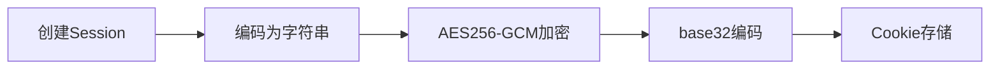
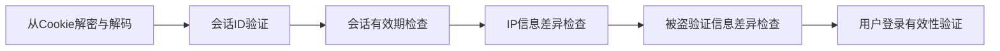

# safesession (安全登录会话)
A safe login session library. (一个安全登录会话库。)

本文的session表示保持登录的session。

在Session的基础上，通过各种辅助验证，以及对加密的巧妙运用，做到了在安全维持登录会话的同时，自身仅存储少量数据，并且即使泄露登录会话凭据，也不太影响安全性。

## 背景
因为http协议是无状态的，所以在网站或APP中需要专门设计如何保持登录。

cookie是浏览器提供的，可以将少量数据保存到客户设备，在访问网站时自动发送给服务器。

常见的保持登录方法根据此包括：

session和jwt。

session的常见做法将cookie值设为一个session id,服务器根据这个值记录是否登录

jwt以json的格式将登录状态信息保存到cookie。

我在做网站的时候修改session的常见做法实现了一个更安全的session，我基于此实现了这个开源的安全登录会话库。

现在是第三版设计，设计方案在[https://qiulaidongfeng.github.io/zh-cn/安全登录会话第三版设计方案/](https://qiulaidongfeng.github.io/zh-cn/%E5%AE%89%E5%85%A8%E7%99%BB%E5%BD%95%E4%BC%9A%E8%AF%9D%E7%AC%AC%E4%B8%89%E7%89%88%E8%AE%BE%E8%AE%A1%E6%96%B9%E6%A1%88/)。

## 生成流程


## 验证流程


## 具体实现
Control 结构体管理所有Session。可以被多个goroutine使用，详情参见相应函数文档。

一个Session由这些信息组成：有效验证信息（ID，创建时间），用户名，被盗验证信息（ip信息（ISP,AS,定位），系统类型、系统版本、浏览器名称、Gps、Screen、PNum、浏览器指纹或设备指纹），CSRF_TOKEN。

**这些字段并不是全部都一定要获取并设置**

用户首次登录时：
- 使用加密安全的随机数生成器生成Session ID。
- 通过调用者提供的方法和客户端ip获取ip信息。
- 通过user-agent获取系统类型，系统版本，浏览器名称。
- 调用者可选提供Gps、Screen、PNum、浏览器指纹或设备指纹。
- 通过调用者提供的方法将Session ID和创建时间保存到服务器。
- 使用自定义编码器将Session编码为字符串
- 经过AES-256-GCM加密（可修改为其他加密方法）和base32编码后，保存到一个名为session或其他调用者指定名称的cookie。
- cookie
  - 默认samesite为Lax，确保从浏览器搜索结果进入网站时，能够自动登录，可修改。
  - Secure和HttpOnly为true，禁止在未加密的http连接或js脚本中被访问。
  - Domain为空使得只能在同一域名被访问，可修改。
  - Path为/使得在整个网站下的所有路径中都是可用的，可修改。

用户后续登录时：
- 从cookie解密并解码得到Session。
- 验证Session ID是否在服务器存在。
- 验证Session本身是否过期,并更新最近一次登录时间。
- 验证ip信息是否在两次登录时相差过大。
- 验证被盗验证信息是否在两次登录时相差过大。
- 验证是否存在并符合只允许在一台设备登录等情况。

调用者自行设置并验证CSRF_TOKEN以防范跨站请求伪造攻击。

一个例子：

对于银行网站，可以先在登录时，响应一个没有CSRF_TOKEN的Session。

然后在进行敏感操作，比如转账时，先通过一个GET请求获取输入账号密码等信息的表单网页，其中有一个隐藏字段包含随机生成的CSRF_TOKEN，Session设置同样的CSRF_TOKEN。

填好后通过一个POST请求提交，验证表单中的CSRF_TOKEN和Session中的CSRF_TOKEN是否一致。

## 安全性分析
256位的ID使得难以伪造safeSession，CreateTime确保无法使用过期的safeSession。

对称密码是量子安全的，而且目前没有公开的有效攻击方法能够破解正确实现的AES-256-GCM。所以通过使用它加密，同时做到了量子安全，以及大部分数据不存在服务器。减轻了服务器存储开销。

Cookie的安全设置加上一系列的特征验证，加上https的要求，使得即使用户配合通过浏览器开发者工具，窃取了Cookie值，并配合在其身旁使用另一条相同型号的电脑，也不意味着一定能成功盗用。

只要一次验证不通过，safeSession就会失效，意味着即使成功窃取，除非一次满足所有验证，就会攻击失败。

总的来说，safeSession的安全性依赖于下列三点做到至少两点：

1. AES-256-GCM密钥未泄露。
2. 服务器数据库保存ID未被篡改。
3. 登录凭据未泄露。

CSRF_TOKEN的存在使得即使利用浏览器的cookie自动发送机制实现跨站请求伪造攻击，也能被防范。

## 非浏览器环境如何使用
此实现可以在非浏览器环境使用，只需要客户端模拟实现Cookie和User-Agent。

User-Agent可以按这个模板生成：

电脑：

Mozilla/5.0 (操作系统; 系统版本; CPU指令集) AppleWebKit/0 (KHTML, like Gecko) APP名/版本号

示例：
Mozilla/5.0 (Windows NT 10.0; Win64; x64) AppleWebKit/0 (KHTML, like Gecko) appname/0.1.0

Mozilla/5.0 (Linux; ; x64) AppleWebKit/0 (KHTML, like Gecko) appname/0.1.0

Mozilla/5.0 (Macintosh; Intel Mac OS X 13.6; ) AppleWebKit/0 (KHTML, like Gecko) appname/0.1.0

手机：
Mozilla/5.0 (Linux; Android 系统版本; 设备型号 Build/系统版本号) AppleWebKit/0 (KHTML, like Gecko) APP名/版本号

Mozilla/5.0 (iPhone; CPU iPhone OS 系统版本 like Mac OS X) AppleWebKit/WebKit版本 (KHTML, like Gecko) APP名/版本号

示例：

Mozilla/5.0 (Linux; Android 15; Pixel 6 Build/TQ3A.230805.001) AppleWebKit/0 (KHTML, like Gecko) appname/0.1.0

Mozilla/5.0 (iPhone; CPU iPhone OS 16——6 like Mac OS X) AppleWebKit/0 (KHTML, like Gecko) appname/0.1.0

Cookie最简单的模拟方法是用一个文件保存Cookie信息，在每次HTTPS请求时带上Cookie。
更安全的做法是利用操作系统提供的机密存储，例如windows的凭据管理器，安卓的Keystore。


## FAQ (常见问题)
1. **更新系统**是否会因两次登录的**系统版本不同**导致登录会话失效？

   非苹果设备一般不会，因为浏览器自动发送的user-agent关于系统版本的部分，分为以下情况
   - 在windows，只有从低于windows10升级到至少windows10会改变。
   - 在linux，一般提供的是cpu指令集种类，比如x86_64，这只在像x86换arm的CPU时会改变。
   - 在android，一般提供的是主版本号，只有像安卓12升到安卓13会导致改变。
   - 在macos和ios,提供的是完整的版本号，系统更新会导致改变。（可以改为只采用相对稳定的主版本号，只是安全性更差）

    **如果设置了Device,仅系统版本改变100%不会导致登录会话失效**
2. **更换手机或电脑**是否会因两次登录的**设备信息不同**导致登录会话失效？

    大概率会的，因为浏览器指纹或硬件指纹会改变，且屏幕等其他被盗验证信息也大概相差较大。

    但可以通过短信验证码等二次验证方式解决。
3. **像从联通改用移动的宽带**是否会因两次登录的**网络运营商不同**导致登录会话失效？

    **如果设置了Device,仅网络运营商改变100%不会导致登录会话失效**
4. **在不同城市登录**是否会因两次登录的**ip属地不同**导致登录会话失效？

   默认实现是国家或省份不一致，或ip定位经纬度相差大于50公里失效。但却决于调用者是否提供了这些信息。且调用者可以自定义判断逻辑。
5. **使用代理等不同网络**是否会因两次登录的**ip的ASN类型不同**导致登录会话失效？
   
   默认实现肯定不会因ip的ASN类型不同导致登录会话失效。

   不过如果用户的ip AS号改变，且浏览器指纹或设备指纹不一致，会的。

## 使用示例
```go
package main

import (
	"encoding/json"
	"math"
	"net"
	"net/http"
	"strings"
	"time"

	"github.com/qiulaidongfeng/key"
	"github.com/qiulaidongfeng/safesession/v3"
)

var m = make(map[string]chan safesession.PostInfo)

func main() {
	// 运行前应设置main_key环境变量

	// 初始化数据库操作
	db := safesession.DB{
		Store: func(ID string, CreateTime time.Time) bool {
			// 实现会话存储逻辑
			return true
		},
		Delete: func(ID string) {
			// 实现会话删除逻辑
		},
		Exist: func(ID string) bool {
			// 实现会话存在检查逻辑
			return true
		},
		Valid: func(UserName string, SessionID string) error {
			// 实现会话表示用户登录状态的有效性验证逻辑
			return nil
		},
	}

	// 初始化控制实例
	control := safesession.NewControl(
		key.Encrypt, key.Decrypt,
		24*time.Hour,         // 会话有效期
		http.SameSiteLaxMode, // SameSite模式
		getIPInfo,            // IP信息获取函数
		db,                   // 数据库操作
	)
	// 可选：添加二次验证
	control.CheckCallBack = func(s *safesession.Session, clientIP, userAgent string, p safesession.PostInfo) bool { return true }
	// 可选：自己验证ip信息是否相差过大
	control.CheckIPInfo = func(old, new safesession.IPInfo) bool { return true }
	// 可选：自定义cookie domain
	control.CookieDomain = func() string { return "yourdomain.com" }
	// 可选：自定义cookie path
	control.CookiePath = func() string { return "/" }

	// 登录处理函数
	http.HandleFunc("/login", func(w http.ResponseWriter, r *http.Request) {
		if r.Method == http.MethodGet {
			// GET请求返回前端html等代码
			return
		}

		// 验证用户身份
		username := "testuser"

		// 获得不带端口号的ip
		// 如需支持使用代理时，通过X-Forwarded-For等请求标头获取真实来源ip，可参考gin.Context.ClientIP的实现。
		ip, _, _ := net.SplitHostPort(strings.TrimSpace(r.RemoteAddr))

		// 创建新会话
		session := control.NewSession(
			ip,
			r.UserAgent(),
			username,
		)

		// 可选：提供更多被盗验证信息
		// 实践中应加锁或用sync.Map
		// 还要考虑超时
		c := make(chan safesession.PostInfo)
		m[username] = c
		session.SetPostInfo(<-c)
		close(c)
		delete(m, username)

		// 设置会话Cookie
		control.SetSession(&session, w)

		http.Redirect(w, r, "/dashboard", http.StatusFound)
	})

	// 可选：接收上传的更多被盗验证信息
	http.HandleFunc("/post", func(w http.ResponseWriter, r *http.Request) {
		p := safesession.PostInfo{
			PNum:   -1,
			Screen: safesession.Screen{Height: -1, Width: -1},
			Gps:    safesession.GpsInfo{Longitude: math.MaxFloat64, Latitude: math.MaxFloat64},
		}
		username := r.Header.Get("user")
		err := json.NewDecoder(r.Body).Decode(&p)
		if err != nil {
			//handle err
		}
		m[username] <- p
	})

	// 受保护的路由
	http.HandleFunc("/dashboard", func(w http.ResponseWriter, r *http.Request) {
		if r.Method == http.MethodGet {
			// GET请求返回前端html等代码
			return
		}

		// POST请求先验证

		// 获取会话Cookie
		cookie, err := r.Cookie("session")
		if err != nil {
			http.Redirect(w, r, "/login", http.StatusFound)
			return
		}

		username := r.URL.Query().Get("user")

		// 可选：提供更多被盗验证信息
		// 实践中应加锁或用sync.Map
		// 还要考虑超时
		c := make(chan safesession.PostInfo)
		m[username] = c
		p := <-c
		close(c)
		delete(m, username)

		// 检查会话有效性
		ok, err, session := control.CheckLogined(
			r.RemoteAddr,
			r.UserAgent(),
			cookie,
			p,
		)

		if !ok {
			http.Error(w, err.Error(), http.StatusUnauthorized)
			return
		}

		// 更新最近一次登录时间
		control.SetSession(&session, w)

		// 会话有效，处理请求
		w.Write([]byte("Welcome, " + session.Name))
	})

	http.ListenAndServe(":8080", nil)
}

// 获取IP信息的示例实现
func getIPInfo(clientIP string) safesession.IPInfo {
	// 实现IP信息获取逻辑，例如调用IP归属地API
	return safesession.IPInfo{Country: "CN"}
}

```

## 贡献指南
欢迎提交Issue和PR，请确保：

- 通过所有单元测试
- 更新相关文档