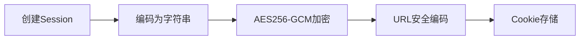
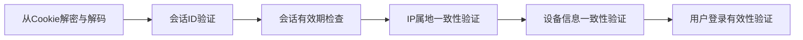

# safesession (安全登录会话)
A safe login session library. (一个安全登录会话库。)

本文的session表示保持登录的session。

## 背景
因为http协议是无状态的，所以在网站或APP中需要专门设计如何保持登录。
cookie是浏览器提供的，可以将少量数据保存到客户设备，在访问网站时自动发送给服务器。

常见的保持登录方法根据此包括：
session和jwt。
session的常见做法将cookie值设为一个session id,服务器根据这个值记录是否登录
jwt以json的格式将登录状态信息保存到cookie。

我在做网站的时候修改session的常见做法实现了一个更安全的session，我基于此实现了这个开源的安全登录会话库。

## 生成流程


## 验证流程


## 具体实现
Control 结构体管理所有Session。可以被多个goroutine使用，详情参见相应函数文档。

一个Session由这些信息组成：ID，用户名，创建时间，ip属地，设备信息（系统类型、系统版本、设备型号、浏览器名称），CSRF_TOKEN。

用户首次登录时：
- 使用加密安全的随机数生成器生成Session ID。
- 通过调用者提供的方法和客户端ip获取ip属地。
- 通过user-agent获取系统类型，系统版本，设备型号，浏览器名称。
- 通过调用者提供的方法将Session ID和创建时间保存到服务器。
- 使用自定义编码器将Session编码为字符串
- 经过AES256-GCM加密和转义为能安全地放置在URL查询的文本后，保存到一个名为session的cookie。
- cookie
  - 默认samesite为Lax，确保从浏览器搜索结果进入网站时，能够自动登录。
  - Secure和HttpOnly为true，禁止在未加密的http连接或js脚本中被访问。
  - Domain为空使得只能在同一域名被访问。
  - Path为/使得在整个网站下的所有路径中都是可用的。

用户后续登录时：
- 从cookie解密并解码得到Session。
- 验证Session ID是否在服务器存在。
- 验证Session本身是否过期。
- 验证ip属地是否在两次登录时一致。
- 验证设备信息是否在两次登录时一致。
- 验证是否存在并符合只允许在一台设备登录等情况。

调用者自行设置并验证CSRF_TOKEN以防范跨站请求伪造攻击。

## 安全性分析
对cookie属性的一系列设置确保了cookie的安全。
随机生成ID和AES256-GCM加密使得Session难以被伪造，服务器保存Session ID使得即使出现伪造的Session，也会因为在服务器数据库没有而被发现。
ip属地检查使得即使Session被窃取，也要使用同一属地ip才可能攻击成功。
设备信息的检查使得使用窃取的Session更加困难，要上述user-agent提供的设备信息相同。
由于ip属地和设备信息被加密存储在cookie，即使窃取了Session甚至黑入了服务器数据库，也无法得到这些信息来实现Session劫持。
CSRF_TOKEN的存在使得即使利用浏览器的cookie自动发送机制实现跨站请求伪造攻击，也能被防范。

## TODO (代办事项)
- 验证ip的网络运营商。
- 验证ip的ASN类型。
- 验证浏览器指纹(这样更安全，但无法仅用一个https请求完成，会增加网页加载延时)

## FAQ (常见问题)
1. **更新系统**是否会因两次登录的**系统版本不同**导致登录会话失效？
   非苹果设备一般不会，因为浏览器自动发送的user-agent关于系统版本的部分，分为以下情况
   - 在windows，只有从低于windows10升级到至少windows10会改变。
   - 在linux，一般提供的是cpu指令集种类，比如x86_64，这只在像x86换arm的CPU时会改变。
   - 在android，一般提供的是主版本号，只有像安卓12升到安卓13会导致改变。
   - 在macos和ios,提供的是完整的版本号，系统更新会导致改变。（可以改为只采用相对稳定的主版本号，只是安全性更差）
2. **更换手机或电脑**是否会因两次登录的**设备型号不同**导致登录会话失效？
    分情况，因为浏览器自动发送的user-agent关于设备型号的部分
    - 在电脑和苹果手机一般不提供设备型号。
    - 使用Chrome和Edge的安卓手机一般不提供设备型号。
    - 其他安卓浏览器会提供设备型号。**只有这种情况**，即使使用换机软件将所有的数据迁移了，也**会导致登录会话失效**。
3. **像从联通改用移动的宽带**是否会因两次登录的**网络运营商不同**导致登录会话失效？
    目前不会，但未来实现了验证ip的网络运营商会的。
4. **在不同城市登录**是否会因两次登录的**ip属地**导致登录会话失效？
   取决于调用者使用的ip属地数据库。
    - 有些数据库只提供到地区，这种不会，因为只有在前往境外地区时会改变。**比如从中国内地前往澳门（来源：《中华人民共和国出入境管理法》第八十九条）**。
    - 有些数据库会提供到省份、城市甚至经纬度，这种可能会的，取决于调用者选择提供多高精度的ip属地数据给库。

## 使用示例
```go
package main

import (
    "net/http"
    "time"

    "github.com/qiulaidongfeng/safesession"
)

func main() {
    // 初始化数据库操作
    db := safesession.DB{
        Store: func(ID string, CreateTime time.Time) bool {
            // 实现会话存储逻辑
            return true
        },
        Delete: func(ID string) {
            // 实现会话删除逻辑
        },
        Exist: func(ID string) bool {
            // 实现会话存在检查逻辑
            return true
        },
        Valid: func(UserName string, SessionID string) error {
            // 实现会话表示用户登录状态的有效性验证逻辑
            return nil
        },
    }

    // 初始化控制实例
    control := safesession.NewControl(
        [32]byte{},              // AES-256密钥 应随机生成
        24*time.Hour,            // 会话有效期
        http.SameSiteLaxMode,    // SameSite模式
        getIPInfo,               // IP信息获取函数
        db,                      // 数据库操作
    )

    // 登录处理函数
    http.HandleFunc("/login", func(w http.ResponseWriter, r *http.Request) {
        // 验证用户身份
        username := "testuser"

        // 获得不带端口号的ip
        // 如需支持使用代理时，通过X-Forwarded-For等请求标头获取真实来源ip，可参考gin.Context.ClientIP的实现。
        ip, _, _ := net.SplitHostPort(strings.TrimSpace(c.Request.RemoteAddr))
        
        // 创建新会话
        session := control.NewSession(
            ip,
            r.UserAgent(),
            username,
        )
        
        // 设置会话Cookie
        control.SetSession(&session, w)
        
        http.Redirect(w, r, "/dashboard", http.StatusFound)
    })

    // 受保护的路由
    http.HandleFunc("/dashboard", func(w http.ResponseWriter, r *http.Request) {
        // 获取会话Cookie
        cookie, err := r.Cookie("session")
        if err != nil {
            http.Redirect(w, r, "/login", http.StatusFound)
            return
        }
        
        // 检查会话有效性
        ok, err, session := control.CheckLogined(
            r.RemoteAddr,
            r.UserAgent(),
            cookie,
        )
        
        if !ok {
            http.Error(w, err.Error(), http.StatusUnauthorized)
            return
        }
        
        // 会话有效，处理请求
        w.Write([]byte("Welcome, " + session.Name))
    })

    http.ListenAndServe(":8080", nil)
}

// 获取IP信息的示例实现
func getIPInfo(clientIP string) safesession.IPInfo {
    // 实现IP信息获取逻辑，例如调用IP归属地API
    return safesession.IPInfo{Country: "CN"}
}
```

## 贡献指南
欢迎提交Issue和PR，请确保：

- 通过所有单元测试
- 更新相关文档